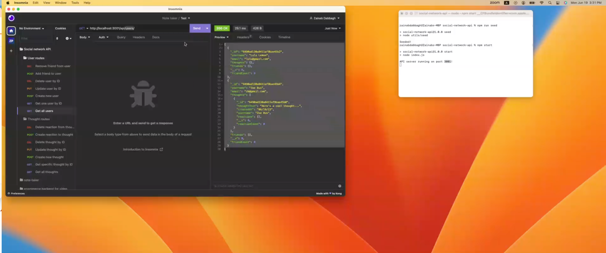

# Social Network API

## Description

This is a back end application for a social network API where users can share their thoughts, react to friends’ thoughts, and create a friend list. I used Express.js for routing, a MongoDB database, and the Mongoose ODM.

## Table of contents

- [Installation](#installation)
- [Usage](#usage)
- [License](#license)
- [Contribution](#contributing)
- [Questions](questions)
- [Walkthrough Video](#walkthrough-video)

## Installation

Once you have navigated to your directory, run the command `npm init —y` Then `npm install`in your command line

## Usage

To use this app, navigate to the location of the repo on your computer in your bash terminal. Once you’re inside the repo, run the `node utils/seed.js` to seed the database. If you've created a seeding script in your package.json, just go ahead and run `npm run seed` in your terminal.

Once all the above is done you can run `npm start` and navigate to insomnia to use the app.

## License

MIT

The MIT License is a permissive open-source license that allows users to use, modify, and distribute software under certain conditions.
      [Read more...](https://opensource.org/licenses/MIT)

## Contributing

This is an open source app. To contribute please make a branch and create a pull request

## Questions

Hi! I'm zeeDabbagh

If you have any questions please email me at dabbagh.zainab@gmail.com

And make sure to follow me on Github at https://github.com/zeeDabbagh!

## Walkthrough Video

Watch the video by clicking on this link or on the image below
https://drive.google.com/file/d/17GxnbGjHxPkoJC-5NPrbG0Ir4Qcqm_Mf/view

